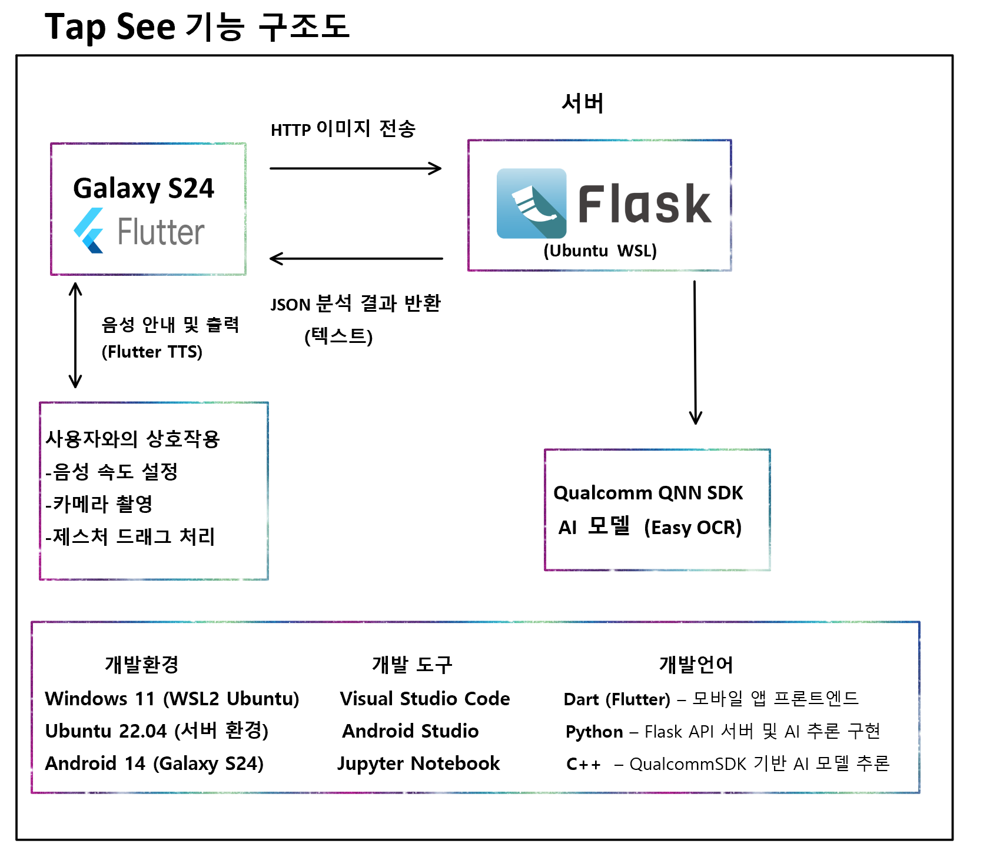
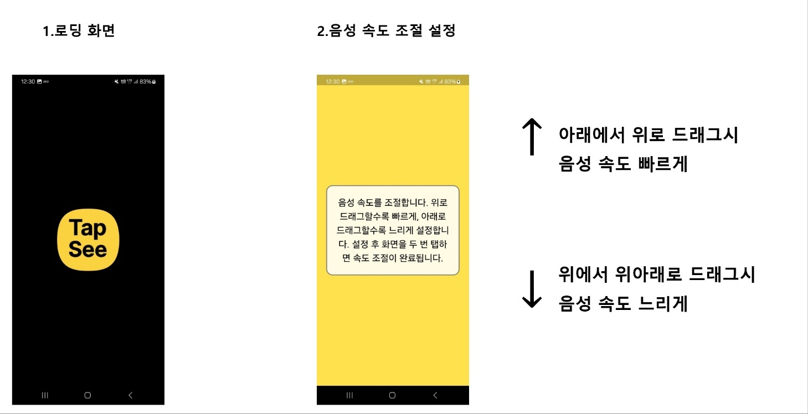

# TapSee  
📱 AI 기반 OCR·음성 안내 앱 (시각장애인 지원용)

---

## 목차
- 프로젝트 수행 목적  
- 프로젝트 개요  
- 기능 구조도  
- 실행 예시  
- 기대 효과

---

## 프로젝트 수행 목적  
본 프로젝트는 Qualcomm AI를 기반으로 문서 및 텍스트를 분석하고, 이를 음성으로 변환하는 프로그램을 개발하는 것을 목표로 합니다. 터치 및 드래그와 같은 단순한 조작만으로 작동하도록 설계되어, 시각장애인을 포함하여 문서 읽기에 어려움을 겪는 사용자들이 보다 쉽고 직관적으로 정보에 접근할 수 있도록 지원합니다.

---

## 프로젝트 개요  
TapSee는 Qualcomm AI 기반의 문서 및 텍스트 인식 시스템으로, OCR을 활용하여 텍스트를 추출하고 이를 음성으로 변환하는 기능을 제공합니다. 앱이 자동으로 텍스트를 분석하고 음성으로 읽어줌으로써 손쉽게 정보를 얻을 수 있습니다.

## 기능 구조도

  

## 실행 예시

   
 
  
촬영 예시
 

## 기대효과
본 프로젝트는 Qualcomm 기반의 OCR 및 음성 합성 기술을 활용하여, 시각장애인이나 문서를 읽기 어려운 사용자들이 다양한 정보를 손쉽게 청취할 수 있도록 지원합니다. 사용자는 카메라로 문서를 촬영하기만 하면 텍스트가 자동으로 인식되고 자연스러운 음성으로 안내되며, 메뉴판, 안내문, 도서 등 실생활 전반에서 유용하게 활용할 수 있습니다. 정보 접근성 향상과 사회적 가치를 동시에 추구합니다.
